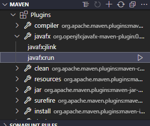
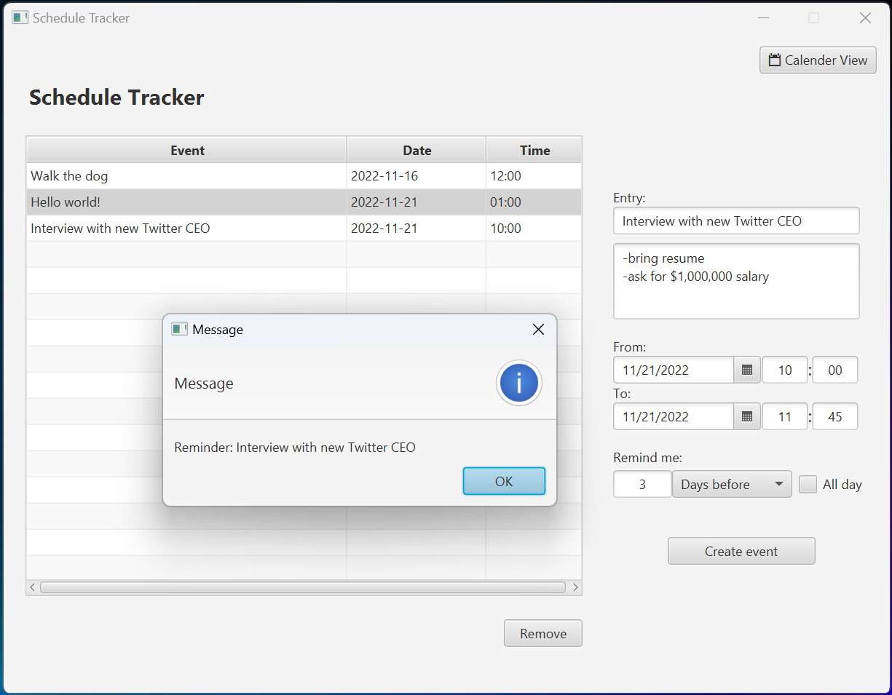
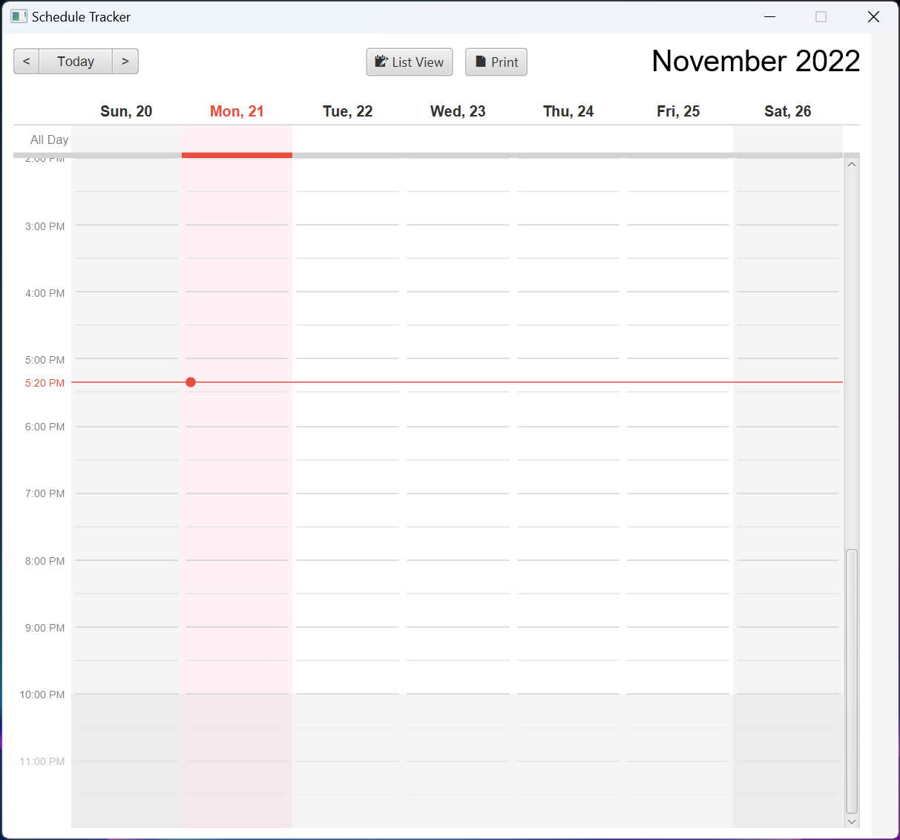
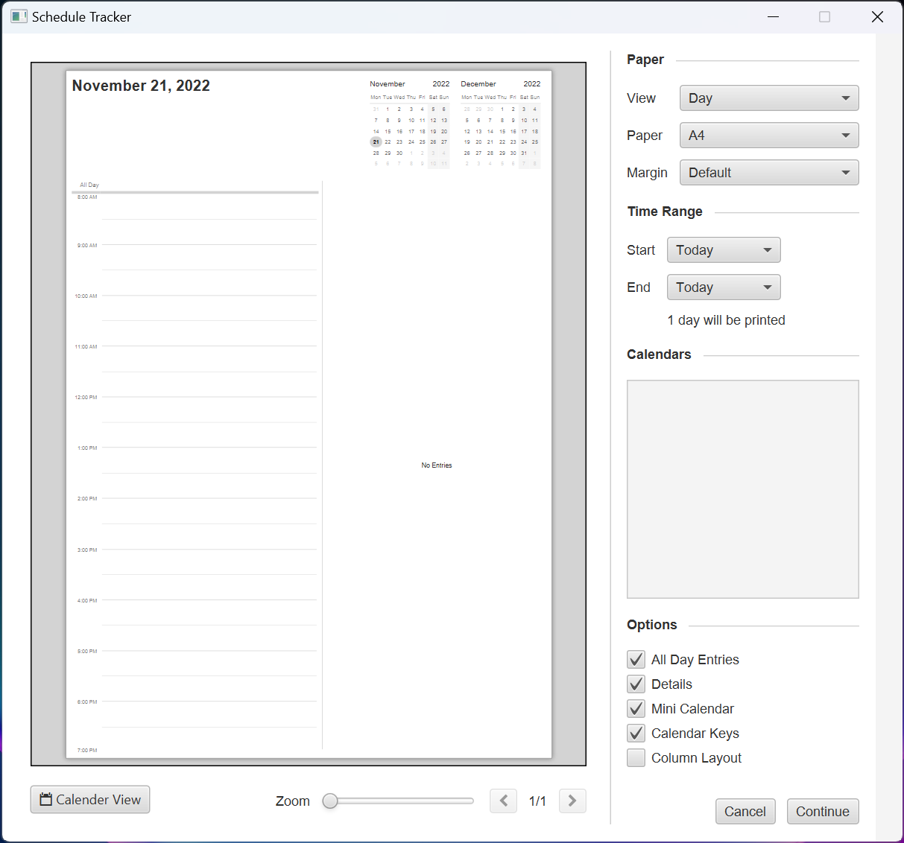

Scheduler App
=============
**SE 350 - Object-Oriented Software Development**

## Run

### Using IDE
You can use Maven plugin and the mvn goal from your IDE (Intellij and VS code). Also, you can directly run 
[**Main Method**](/project/src/main/java/com/se350/scheduler/App.java).

### Intellij or VS Code

### Using Maven

Alternatively, you can run the game by executing the following command in terminal. Make sure you are in the root directory of Tetris application.

`mvn clean javafx:run
`

## Screenshots
**List view (functional):**

**Calendar view (somewhat functional):**

**Print view (somewhat functional):**

